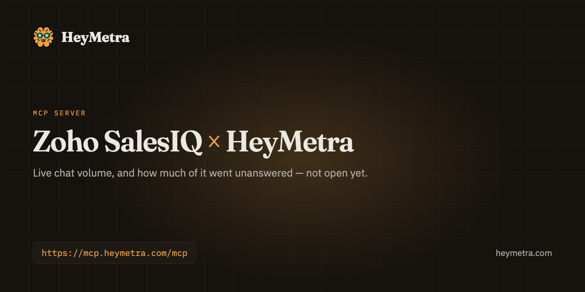

<div align="center">



# Zoho SalesIQ &times; HeyMetra

**Live chat volume, and how much of it went unanswered — not open yet.**

Your pipeline lives in Zoho SalesIQ. What it cost to fill it lives somewhere else entirely. Ask once, across both.

[](https://registry.modelcontextprotocol.io/v0/servers/com.heymetra%2Fheymetra/versions)
[](https://modelcontextprotocol.io/)
[](https://heymetra.com/security/)
[](https://heymetra.com/connectors/zoho-salesiq/)

```
https://mcp.heymetra.com/mcp
```

</div>

---

## Ask it things like

> How many chats came in last week, and how many did nobody answer?

> Which department took the most chats this month?

> Which days of the week are busiest on live chat?

No dashboard, no export, no query language. You ask in the assistant you already use and the answer comes back with the account it came from.

## Connect Zoho SalesIQ

1. When SalesIQ opens, choose it on the Connections screen in HeyMetra — separately from Zoho CRM, even if you have already connected that.
2. Sign in on Zoho's own screen with an account that can read SalesIQ. Your password stays with Zoho.
3. Review what Zoho shows: permission to list your portals and to read conversations. Nothing about your CRM, and nothing that can send a message.
4. Pick the portal to grant — one connection is one portal.
5. Add HeyMetra to your MCP client — Claude, ChatGPT, Cursor or Codex — with the details HeyMetra gives you; the SalesIQ tool appears there.

## Then add HeyMetra to your assistant

Add HeyMetra once and it is there in every conversation. The address is the same everywhere:

```
https://mcp.heymetra.com/mcp
```

### One command

```bash
npx add-mcp https://mcp.heymetra.com/mcp
```

[`add-mcp`](https://www.npmjs.com/package/add-mcp) is a third-party installer that writes the configuration for Claude Code, Codex, Cursor, Antigravity, VS Code and seventeen other agents. It infers the name from the address, so the server lands as `heymetra`. Run against this endpoint before it was written here.

### Or by hand

<details>
<summary><b>Claude</b> — Settings → Customize → Connectors → Add custom connector</summary>

Paste the address above into Settings → Customize → Connectors → Add custom connector.

_On Team and Enterprise plans only an owner can add it, under Organization settings._

Full walkthrough: [heymetra.com/mcp/claude/](https://heymetra.com/mcp/claude/)
</details>

<details>
<summary><b>ChatGPT</b> — Settings → Security and login → Developer mode, then chatgpt.com/plugins</summary>

Paste the address above into Settings → Security and login → Developer mode, then chatgpt.com/plugins.

_The endpoint has to include its /mcp path here._

Full walkthrough: [heymetra.com/mcp/chatgpt/](https://heymetra.com/mcp/chatgpt/)
</details>

<details>
<summary><b>Grok</b> — grok.com/connectors → New Connector → Custom</summary>

Paste the address above into grok.com/connectors → New Connector → Custom.

_XAI calls this “bring your own MCP”._

Full walkthrough: [heymetra.com/mcp/grok/](https://heymetra.com/mcp/grok/)
</details>

<details>
<summary><b>Perplexity</b> — Settings → Connectors → Custom connector → Remote</summary>

Paste the address above into Settings → Connectors → Custom connector → Remote.

_Perplexity documents it as a Pro, Max and Enterprise feature._

Full walkthrough: [heymetra.com/mcp/perplexity/](https://heymetra.com/mcp/perplexity/)
</details>

<details>
<summary><b>Claude Code</b> — claude mcp add --transport http</summary>

```bash
claude mcp add --transport http heymetra https://mcp.heymetra.com/mcp
```

_Or a .mcp.json in the project root; /mcp inside a session shows what connected._

Full walkthrough: [heymetra.com/mcp/claude-code/](https://heymetra.com/mcp/claude-code/)
</details>

<details>
<summary><b>Codex</b> — ~/.codex/config.toml</summary>

```toml
[mcp_servers.heymetra]
url = "https://mcp.heymetra.com/mcp"
```

_Under an [mcp_servers.<name>] section, then codex mcp login._

Full walkthrough: [heymetra.com/mcp/codex/](https://heymetra.com/mcp/codex/)
</details>

<details>
<summary><b>Cursor</b> — ~/.cursor/mcp.json, or .cursor/mcp.json in a project</summary>

```json
{
  "mcpServers": {
    "heymetra": { "url": "https://mcp.heymetra.com/mcp" }
  }
}
```

_Leave the static OAuth fields empty — they exist for servers that cannot register themselves._

Full walkthrough: [heymetra.com/mcp/cursor/](https://heymetra.com/mcp/cursor/)
</details>

<details>
<summary><b>Antigravity</b> — ~/.gemini/config/mcp_config.json, or .agents/mcp_config.json in a project</summary>

```json
{
  "mcpServers": {
    "heymetra": { "serverUrl": "https://mcp.heymetra.com/mcp" }
  }
}
```

_The key is serverUrl, not url — the one every other JSON client spells differently._

Full walkthrough: [heymetra.com/mcp/antigravity/](https://heymetra.com/mcp/antigravity/)
</details>

## What it may and may not touch

Zoho SalesIQ is a read-only source — HeyMetra reads it to answer questions and never changes the account.

Permissions are switched on per connection, and one you leave off is a tool your assistant never sees.

| Permission | What it covers | Changes anything? |
|---|---|---|
| **Included with the connection** | What HeyMetra needs to set the connection up and nothing more. It cannot be switched off on its own — removing the connection is how you withdraw it. | No, read only |
| **Chats** | Count conversations and split them by status, department, operator, brand or day. The messages themselves are never read. | No, read only |

<details>
<summary>What each permission lets an assistant do, in full</summary>

- Counts the chats that came in over a period by status, department, operator, brand or day. What a visitor typed, and their details, are never requested.
</details>

## What HeyMetra reads from Zoho SalesIQ

Not open yet: SalesIQ needs its own sign-in separate from Zoho CRM, and that connection has not been proven end to end. When it opens, your MCP client gets a tool that counts the chats started in a period and splits them by status — including the ones nobody picked up — by department, by the operator who took them, by brand, or by day. A missed chat is a lead that leaves no record in the CRM at all, which is the question this connector exists for. What a visitor typed, and their name, email and phone number, are never requested from Zoho and never returned. Connecting SalesIQ asks for nothing from your CRM, and connecting your CRM asks for nothing here. Read-only: no tool sends a chat message.

<details>
<summary>About Zoho SalesIQ</summary>

Zoho SalesIQ is the live chat and visitor tracking on your website. It is where somebody who is not yet a lead asks their first question.
</details>

## One connection, not seven

The reason to read Zoho SalesIQ through HeyMetra rather than through a server that only knows Zoho SalesIQ is everything else it can answer in the same breath:

**Ads** — [Google Ads](https://heymetra.com/connectors/google-ads/) · [Meta](https://heymetra.com/connectors/meta-ads/)

**Analytics** — [Google Analytics 4](https://heymetra.com/connectors/google-analytics-4/) · [Google Search Console](https://github.com/zeisoft/google-search-console-mcp)

**Ecommerce** — [Shopify](https://heymetra.com/connectors/shopify/) · [Trendyol](https://github.com/zeisoft/trendyol-mcp) · [WooCommerce](https://github.com/zeisoft/woocommerce-mcp)

**Revenue & CRM** — [Stripe](https://heymetra.com/connectors/stripe/) · [HubSpot](https://heymetra.com/connectors/hubspot/) · [Zoho CRM](https://github.com/zeisoft/zoho-crm-mcp) · **Zoho SalesIQ** · [Zoho Marketing Automation](https://github.com/zeisoft/zoho-marketing-automation-mcp)

**Mobile** — [AppsFlyer](https://github.com/zeisoft/appsflyer-mcp) · [RevenueCat](https://heymetra.com/connectors/revenuecat/) · [Adapty](https://github.com/zeisoft/adapty-mcp) · [App Store Connect](https://github.com/zeisoft/app-store-connect-mcp)

**Channels** — [Slack](https://github.com/zeisoft/slack-mcp) · [Telegram](https://github.com/zeisoft/telegram-mcp)

The full catalogue is at [heymetra.com/connectors/](https://heymetra.com/connectors/).

## Links

- [Zoho SalesIQ connector page](https://heymetra.com/connectors/zoho-salesiq/)
- [HeyMetra](https://heymetra.com/) — what the product is
- [Setup for every assistant](https://heymetra.com/mcp/)
- [Security and limits](https://heymetra.com/security/)
- [Pricing](https://heymetra.com/pricing/)
- [HeyMetra's own repository](https://github.com/zeisoft/heymetra-mcp)

---

<sub>Built by <a href="https://zeisoft.com">Zeisoft</a>, who make HeyMetra. Not affiliated with Zoho SalesIQ. This README is generated from HeyMetra's live connector catalogue and refreshed daily; corrections are welcome as issues.</sub>
